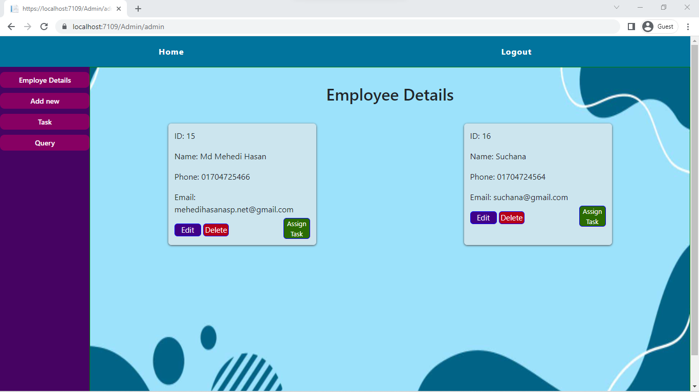
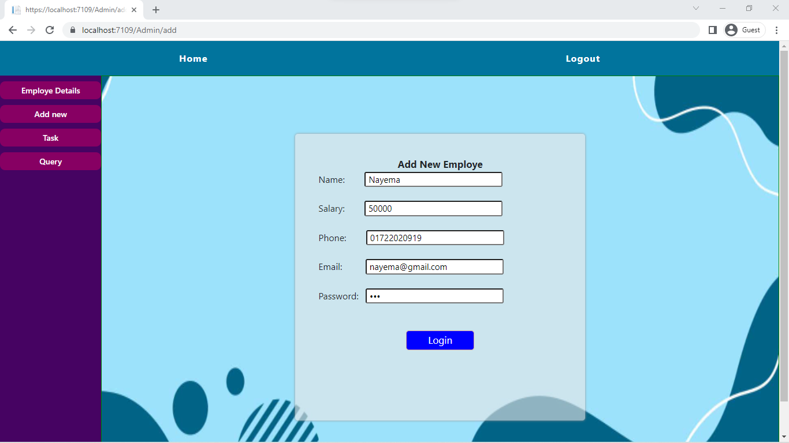
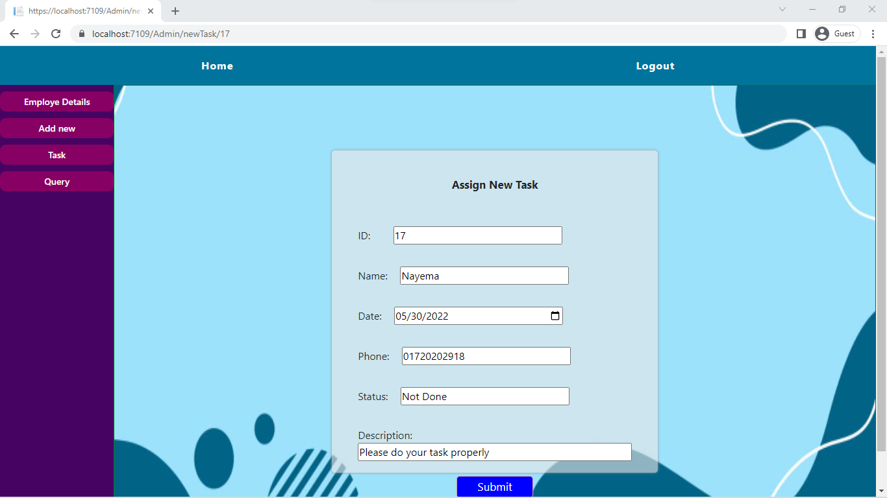
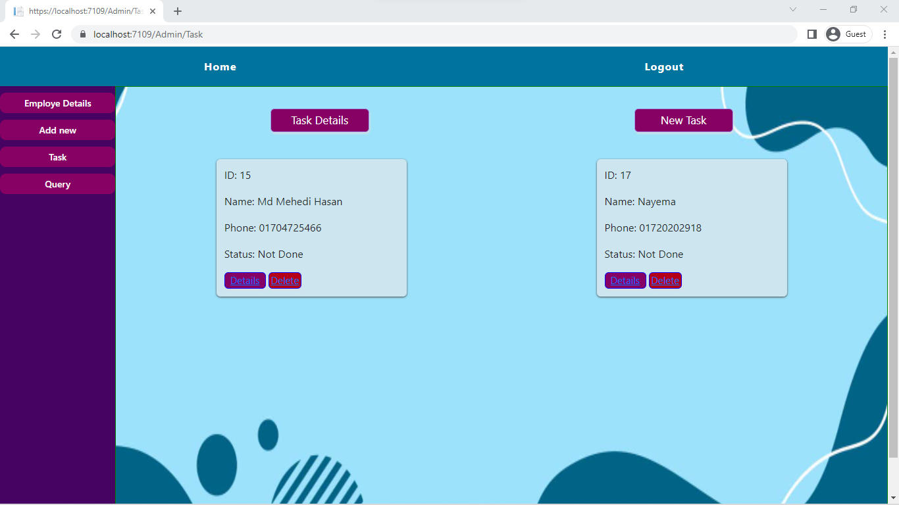
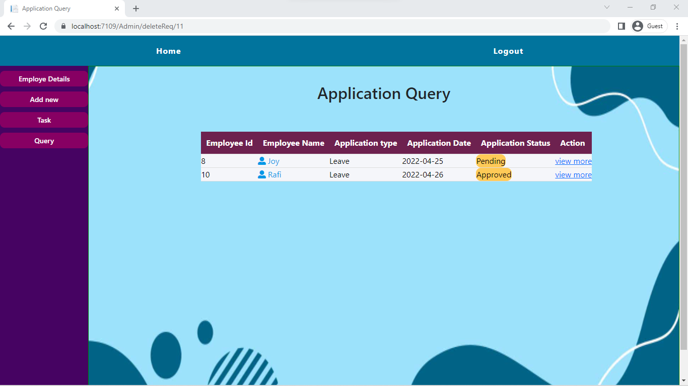
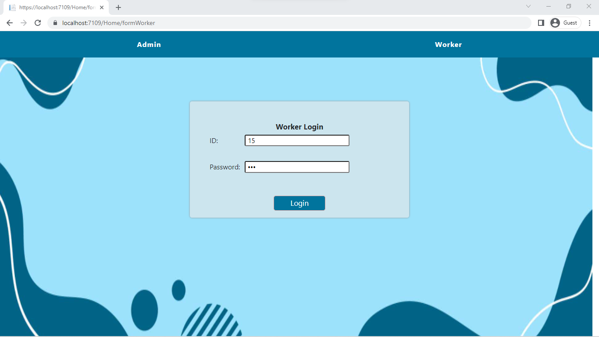
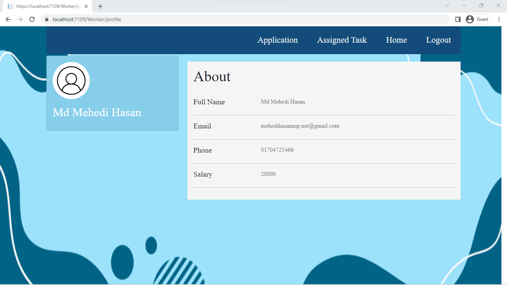
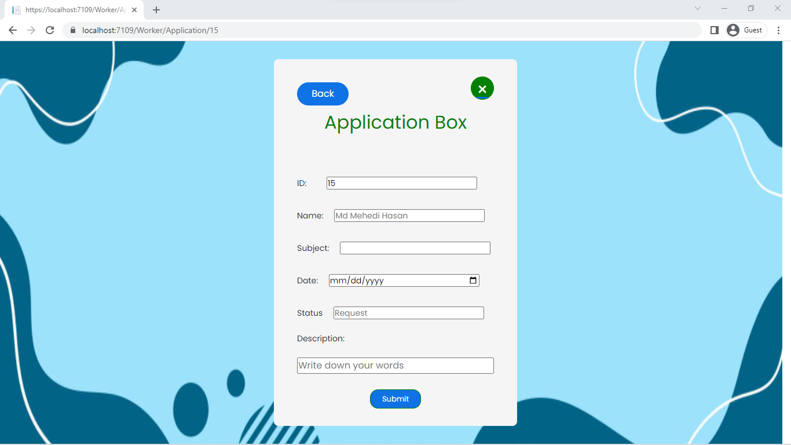
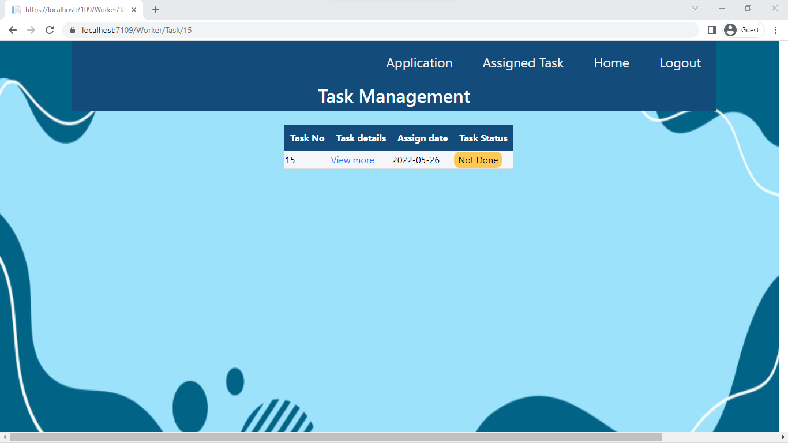

<h2>Project: Employee Management | ASP.NET Core 6 and MVC </h2>

In this very basic project using tech C# ASP.NET Core 6 and MVC. Basic functionality of this project Admin and Employee can login and Admin can assing task to Specific Employee, see status, Employee view own profile and more

<h3>Overview</h3>
<h3>Home Page</h3>

<h3>Admin Login (id=123, pass: abc)</h3>

<h3>Employee Details</h3>

<h3>Create New Employee</h3>

<h3>Assig Task to Employee</h3>

<h3>Show Task</h3>

<h3>Query Application</h3>

<h3>Employee Login (Set by Admin)</h3>

<h3>Employee Profile</h3>

<h3>Employee can Application for sometings</h3>

<h3>Given task to Employee</h3>

<h2>Thank you</h2>

